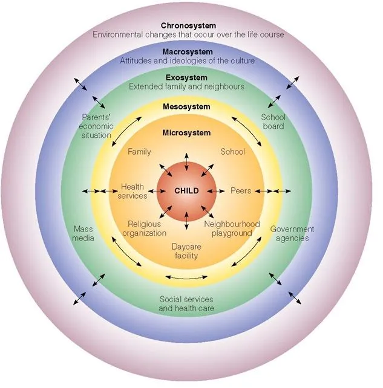
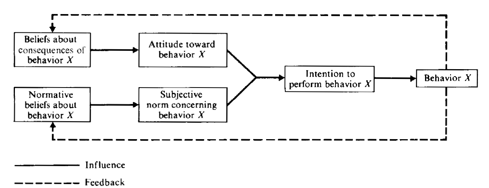

 

<!--set global settings--> 
```{r, globalsettings, echo=FALSE, warning=FALSE}
library(knitr)
opts_chunk$set(tidy.opts=list(width.cutoff=100),tidy=TRUE, warning = FALSE, message = FALSE, cache=TRUE, attr.source = ".numberLines", class.source="highlightt", results= "hold")
options(width = 100)
```


<!--copy to clipboard-->
```{r klippy, echo=FALSE, include=TRUE}
require(klippy)
klippy::klippy(position = c('top', 'left'))
#klippy::klippy(color = 'darkred')
#klippy::klippy(tooltip_message = 'Click to copy', tooltip_success = 'Done')
```
<!---
https://www.w3schools.com/w3css/w3css_buttons.asp
https://www.freecodecamp.org/news/a-quick-guide-to-styling-buttons-using-css-f64d4f96337f/
--->

<!---
<style>
.btn-text-right{
	text-align: right;
}
</style>

<div class="btn-text-right">
<button onclick="window.location.href='static/index.Rmd';">download .Rmd </button>  
</div>

--->

## Bronfenbrenner Ecological Systems Theory

See: @bronfenbrenner1977toward  


```{r EST, echo=FALSE, fig.cap="Ecological Systems Theory", out.width = '100%'}

```

[source](https://www.simplypsychology.org/Bronfenbrenner.html)


This is definitely not a SEM anymore. So, what is the story this heuristic conceptual model wants to tell?  

1. **Complexity:** The model looks quite complex. The development of a child is affected by many complex relationships.  
2. **Simultaneity:** The development of a child is impacted by different type of environmental settings (or systems) simultaneously.  
3. **Importancy:** Because the child is placed in the center, this model seems to imply that the micro system is most important for the development.  
4. **Interdependency:** The arrows seem to imply that there is interaction (or interdependencies) *between* adjacent layers and that *within* each environmental setting different actors or agents play a role.   


---  


## Theory of Reasoned Action

Or Theory of Planned Behavior

See: @Fishbein1975

```{r TPB, echo=FALSE, fig.cap="Schematic presentation of conceptual framework for the prediction of specific intentions and behaviors", out.width = '100%'}

```

[source](https://people.umass.edu/aizen/f&a1975.html)


This actually looks quite similar to the more formal conceptual models we discussed earliers. However, we do see some interesting tweaks.  

1. We see that we can play with the line type (dashed or continuous) and give them a different meaning.  
2. We also see that the arrows from *Attitude toward behavior X* and *Subjective norm concerning behavior X* are combined. So, both of them are necessary conditions in order to come to an *Intention to perform behavior X*. Thus with more heuristic conceptual models you can make a distinction between necessary conditions and sufficient conditions for the outcome.  

If you are interested multiple causality and in the distinction between necessary conditions, sufficient conditions and 'Insufficient but Non-redundant  part of an Unnecessary but Sufficient' conditions you may want to have a look at [necessary-condition-analysis](https://www.erim.eur.nl/necessary-condition-analysis/) and [Qualitative Comparative Analysis](https://www.compasss.org/) 


---  

## Other examples? 

1. Maslow's hierarchy of needs model.  
2. The policy cycle  
3. The empirical cycle  
4. Constrained choice model  

---  

## References  

