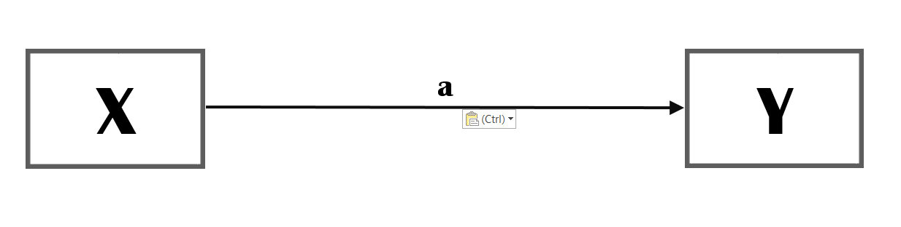

<!--set global settings--> 
```{r, globalsettings, echo=FALSE, warning=FALSE}
library(knitr)
opts_chunk$set(tidy.opts=list(width.cutoff=100),tidy=TRUE, warning = FALSE, message = FALSE, cache=TRUE, attr.source = ".numberLines", class.source="highlightt", results="hold")
options(width = 100)
```


<!--copy to clipboard-->
```{r klippy, echo=FALSE, include=TRUE}
require(klippy)
klippy::klippy(position = c('top', 'left'))
#klippy::klippy(color = 'darkred')
#klippy::klippy(tooltip_message = 'Click to copy', tooltip_success = 'Done')
```
<!---
https://www.w3schools.com/w3css/w3css_buttons.asp
https://www.freecodecamp.org/news/a-quick-guide-to-styling-buttons-using-css-f64d4f96337f/
--->

<!---
<style>
.btn-text-right{
	text-align: right;
}
</style>

<div class="btn-text-right">
<button onclick="window.location.href='static/index.Rmd';">download .Rmd </button>  
</div>

--->

## The Conceptual Model  

```{r correlation, echo=FALSE, fig.cap="correlation", out.width = '100%'}

```


---  

## Explanation  

In a conceptual model, the concepts are normally placed in a rectangular. We have two concepts, **X** and **Y**.  
The single headed arrow indicates that you assume a causal relation from **X** (on the left) to **Y** on the right. Thus: if X increases, Y will increase as a result as well; the more X, the more Y.   
It is not always necessary to label the paths but for this tutorial it will turn out to be handy. Normally, when there is no sign (or label) it is assumed that the path has a positive valence. It is, however, good practice to include the valence of the paths in your conceptual models, i.e. replace *a* with *+* or *-*.  


{}
Please note, I use the label *concept* and not *variable*. A *variable* is something that is part of your dataset, measured by, for example, a survey item. A concept is a theoretical construct, and the concept as intended may have relations - according to your theory - with other concepts. This concept is measured by one or more variables, the 'concept as measured'.  
It is generally a good idea to use concepts that are (very) close to your actual measurements. Thus, although you may use the concept *social cohesion* in your conceptual model, this concept is overly broad and there is a fierce debate on how it should be defined. If you have measured social cohesion with for example a single item on generalized trust ("Generally speaking would you say that most people can be trusted or that you can't be too careful in dealing with people?") why not use the concept generalized trust in your conceptual model? 
{}

---  

## Abstract hypothesis/hypotheses  

Hypo: X leads to Y.  
or:  
Hypo: The more X, the more Y

---  

## Real life example  

X is occupational success.  
Y is health 

Hypo 1a: Occupational success will lead to better health. 

Note, that we used the same concepts as in the previous example (an association between occupational success and health). That we now formulate a causal path should be informed by theory.  


---  

## Structural equations   

- Y=X  

or, following the syntax of the R package **Lavaan**

- Y~X  

The single `~` indicates a direct effect (regression path). 

---  

## Formal test of hypotheses  

Load the NELLS data.  

```{r}
rm(list=ls()) #empty environment
require(haven)
nells <- read_dta("../static/NELLS panel nl v1_2.dta") #change directory name to your working directory
```

Operationalize concepts.

```{r}
# We will use the data of wave 2.
nellsw2<- nells[nells$w2cpanel==1,]

# As an indicator of occupational success we will use income in wave 2.
table(nellsw2$w2fa61, useNA="always")
attributes(nellsw2$w2fa61)
#recode (I will start newly created variables with cm from conceptual models)
nellsw2$cm_income <- nellsw2$w2fa61
nellsw2$cm_income[nellsw2$cm_income==1] <- 100
nellsw2$cm_income[nellsw2$cm_income==2] <- 225
nellsw2$cm_income[nellsw2$cm_income==3] <- 400
nellsw2$cm_income[nellsw2$cm_income==4] <- 750
nellsw2$cm_income[nellsw2$cm_income==5] <- 1250
nellsw2$cm_income[nellsw2$cm_income==6] <- 1750
nellsw2$cm_income[nellsw2$cm_income==7] <- 2250
nellsw2$cm_income[nellsw2$cm_income==8] <- 2750
nellsw2$cm_income[nellsw2$cm_income==9] <- 3250
nellsw2$cm_income[nellsw2$cm_income==10] <- 3750
nellsw2$cm_income[nellsw2$cm_income==11] <- 4250
nellsw2$cm_income[nellsw2$cm_income==12] <- 4750
nellsw2$cm_income[nellsw2$cm_income==13] <- 5250
nellsw2$cm_income[nellsw2$cm_income==14] <- 5750
nellsw2$cm_income[nellsw2$cm_income==15] <- 6500
nellsw2$cm_income[nellsw2$cm_income==16] <- 7500
nellsw2$cm_income[nellsw2$cm_income==17] <- NA
# let us scale the variable a bit and translate into income per 1000euro
nellsw2$cm_income <- nellsw2$cm_income/1000

#from household income to personal income
attributes(nellsw2$w2fa62)
table(nellsw2$w2fa62, useNA="always")
nellsw2$cm_income_per <- nellsw2$w2fa62
nellsw2$cm_income_per[nellsw2$cm_income_per==1] <- 0
nellsw2$cm_income_per[nellsw2$cm_income_per==2] <- 10
nellsw2$cm_income_per[nellsw2$cm_income_per==3] <- 20
nellsw2$cm_income_per[nellsw2$cm_income_per==4] <- 30
nellsw2$cm_income_per[nellsw2$cm_income_per==5] <- 40
nellsw2$cm_income_per[nellsw2$cm_income_per==6] <- 50
nellsw2$cm_income_per[nellsw2$cm_income_per==7] <- 60
nellsw2$cm_income_per[nellsw2$cm_income_per==8] <- 70
nellsw2$cm_income_per[nellsw2$cm_income_per==9] <- 80
nellsw2$cm_income_per[nellsw2$cm_income_per==10] <- 90
nellsw2$cm_income_per[nellsw2$cm_income_per==11] <- 100
nellsw2$cm_income_per[nellsw2$cm_income_per==12] <- NA

nellsw2$cm_income_ind <- nellsw2$cm_income * nellsw2$cm_income_per/100

#as an indicator of health we will use subjective well being from 5 (excellent) to 1 (bad) thus we have to reverse code original variable

attributes(nellsw2$w2scf1)
table(nellsw2$w2scf1, useNA="always")
nellsw2$cm_health <- 6 - nellsw2$w2scf1

```

And test the direct effect. Naturally, there are many ways to test for a direct effect in R but in this tutorial I will try to do everything at least also in the package **Lavaan**. 

But first plot the association and add the regression line:
```{r}
#I randomly select 200 respondents otherwise the plot will be too crowded
selection <- sample(1:length(nellsw2$cm_income_ind), 200, replace=FALSE) 
#because we are interested in a correlation, I plot the standardized variables
plot(nellsw2$cm_income_ind[selection], nellsw2$cm_health[selection])
abline(lm(nellsw2$cm_income_ind~nellsw2$cm_health), lwd=4, col="red")
```
I hope you observe that the regression line does not fit the data very well. 

And now,...estimate the direct effect via `lm()`:

```{r}
summary(lm(nellsw2$cm_income_ind~nellsw2$cm_health))
```
And with **Lavaan**.

```{r}
require(lavaan)
#observed
var(cbind(nellsw2$cm_income_ind,nellsw2$cm_health), na.rm=TRUE)
cor(cbind(nellsw2$cm_income_ind,nellsw2$cm_health), use="pairwise.complete.obs", method="pearson")

#estimated
model <- "
  cm_income_ind ~ cm_health 
  cm_income_ind ~ 1 #include intercept
  
  cm_health ~~ cm_health #error variance
  "

fit <- cfa(model, data = nellsw2) #I use cfa instead of lavaan. The only advantage is that I don't have to tell lavaan that I also need the (co)variances of the exogenous variables. 
summary(fit, standardized=TRUE)
inspect(fit,'r2') #to obtain r-squared
#parameterEstimates(fit)
```
Let us briefly discuss the results:  

- The direct effect is *0.088**. A causal interpretation would be: if your income increases with 1000euros your health will improve by 0.088 (on a scale from 1-5).  
- You will also observe that the standardized regression coefficient is 0.80 which is exactly the same as the estimated correlation between our two concepts previously. Thus the correlation and direct effect models are equivalent and we should be very cautious in giving our regression coefficient a causal interpretation.  
- I hope you also observe that the explained variance is very low (and thus that the error variance of our health variables is almost identical to the observed variance). Perhaps, you should conclude that even though the strong significant effect the impact (or linear relation) between income and health is not substantial and negliable?   

**Take Home Messages**  

- A significant direct effect does not mean it is meaningful.  
- A direct effect cannot always be given a causal interpretation.  


---  


