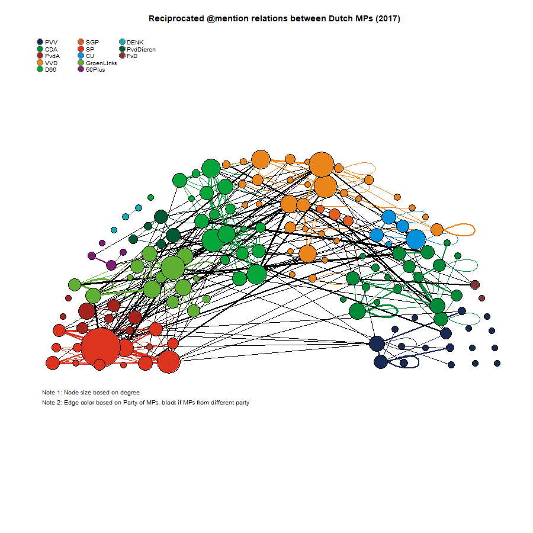

 
<!--set global settings--> 
```{r, globalsettings, echo=FALSE, warning=FALSE}
library(knitr)
opts_chunk$set(tidy.opts=list(width.cutoff=100),tidy=TRUE, warning = FALSE, message = FALSE, cache=TRUE, attr.source = ".numberLines", class.source="highlightt")
options(width = 100)
```


<!--copy to clipboard-->
```{r klippy, echo=FALSE, include=TRUE}
require(klippy)
klippy::klippy()
klippy::klippy(position = c('top', 'left'))
#klippy::klippy(color = 'darkred')
#klippy::klippy(tooltip_message = 'Click to copy', tooltip_success = 'Done')
```
<!---
https://www.w3schools.com/w3css/w3css_buttons.asp
https://www.freecodecamp.org/news/a-quick-guide-to-styling-buttons-using-css-f64d4f96337f/
--->

<!---
<button onclick="window.location.href='static/index.Rmd';">download code</button>
--->


  


# Introduction

In this assignment/tutorial I will demonstrate how to plot networks with the [igraph](http://igraph.org/) package. During the workgroup I will explain all code. For those of you who don't attend the workgroups, google knows way more than I do.  
Someone who also knows more than I do, especially with respect to plotting of Social Networks is **Katya Ognyanova** (aka Kateto). Please visit her [site](https://kateto.net/).

{}
In the upper left and right corner of the code blocks you will find copy-to-clipboard buttons. Use these buttons to copy the code to your own editor. 
{}


# Before you start

Before you start, check whether you run the latest RStudio version (from the Help menu, pick 'check for updates' and whether you need to update R. 

```{r update, eval=FALSE}
install.packages("installr")  #you  first install packages
require(installr)  #then you will need to activate packages. 
updateR() #run the function to start the update process
```


Give your script a nice name. Include the author, and data when you last modified the script. Include a lot of comments in your script! Don't forget, always start with cleaning up your workspace. 

```{r cleanup}
###Author: JOCHEM TOLSMA###
###Lastmod: 31-08-2020###

#cleanup workspace
rm (list = ls( )) 
```

And set your working directory. 
```{r setwd, eval=FALSE}
#set working directory
setwd("C:\\YOURDIR\\YOURSUBDIR\\YOURSUBSUBDIR\\")  #change to your own workdirectory
```

Install the packages you will need. 

```{r packages, eval=FALSE}
#install packages
library(igraph)
```


# Data

We are going to play with Twitter Networks among Dutch MPs. 


```{r, echo=FALSE}
xfun::embed_file("twitter_20190919.Rdata")
```

  
  
Load the Robject and have a look at it. Save the list elements in separate objects. 

```{r,  attr.source = '.numberLines', results='hold'}
load("static/twitter_20190919.RData") #change to your working directory
str(twitter_20190919,1)
keyf <- twitter_20190919[[1]]
mydata <- twitter_20190919[[2]]
seats <- twitter_20190919[[3]]

```
So, what do we have? 

- keyf: a data.frame on 147 Dutch MPs. 
- mydata: This an object which is ready to analyze in RSiena. It is actually a quite complicated object. For now three things are important:  
  1. The nodes in mydata are the same as in keyf and in seats.  
  2. It contains the twitter data at three timepoints (in `mydata$depvars`). We have three layers: 
    - fnet: who follows whom
    - atmnet: who atmentions whom
    - rtnet: who retweats whom  
  3. It also contains timeinvariant information on the nodes (in `mydata$cCovars`)
- seats: a dataset which contains the coordinates of the seats in the House of Parliament in the Netherlands. 

{}

We are going to focus on the atmentions of politicians. This is most closely related to political discussion. Thus who is having discussions with whom on Twitter? 

{}

Let us go fishing for some data: 

```{r}
fnet <- mydata$depvars$fnet
atmnet <- mydata$depvars$atmnet
rtnet <- mydata$depvars$rtnet

vrouw <- mydata$cCovars$vrouw
partij <- mydata$cCovars$partij
ethminz <- mydata$cCovars$ethminz
lft <- mydata$cCovars$lft

#if you construct an object for RSiena, covariates are mean centered by default. I would like to have the original values again. 
ethminz <- ethminz + attributes(ethminz)$mean
partij <- partij + attributes(partij)$mean
vrouw <- vrouw + attributes(vrouw)$mean
lft <- lft + attributes(lft)$mean

```

Have a look at the network data. What are we a looking at? 

```{r}
str(fnet)
#It is just a 'sienaDependent' something [1:147,1:147,1:3]

fnet1 <- fnet[,,1]
atmnet1 <- atmnet[,,1]
atmnet2 <- atmnet[,,2]
atmnet3 <- atmnet[,,3]
```

It is just a 'sienaDependent' something `[1:147,1:147,1:3]` but with a lot of attributes which we may ignore for now. It is an array. In this array our nominations are stored in  adjacency matrices. I selected the friendship relations and the atmention relations of the first wave. 

{}
You may wonder why we only have 147 nodes (of MPs) in our data. Well that is because at the time of writing three MPs did not have a twitter account or at least we could not find it. 
{}


One final thing before we can go and play with the data. We have to replace the missing values of RSiena `10` (structural zeros) into `0` (or `NA`) as well. 

```{r}

# table(fnet1, useNA="always") #uncomment if you want
fnet1[fnet1==10] <- 0
# table(fnet1, useNA="always") #uncomment if you want

atmnet1[atmnet1==10] <- 0
atmnet2[atmnet2==10] <- 0
atmnet3[atmnet3==10] <- 0


```


# First plots

The first step is to make a 'graph object'. 

```{r}
library(igraph)

G1 <- igraph::graph_from_adjacency_matrix(atmnet1, mode = "directed", weighted = NULL, diag = TRUE,  add.colnames = NA, add.rownames = NA)


```

Suppose you would like to add the data to this graph. 
```{r}
require(igraph) 
#we need to retrieve the edges. 
edges <- as_data_frame(G1, what="edges")

#the first variable of the data we can attach needs to be some id, thus reorder columns of keyf
keyf <- cbind(keyf$EGOid, keyf[,names(keyf)!="EGOid"])
#the name has been changed as well. Lets correct this
names(keyf)[1] <- "EGOid"

#rebuild the graph. 
G1 <- graph_from_data_frame(edges, directed=TRUE, vertices=keyf)

#I am a bit puzzled where the data is stored exactly but the same data as in keyf is now attached to the vertices. 

#thus to find the names of our MPs we could now do this: 
V(G1)$Naam
```

But now let us start plotting. 

```{r}
plot(G1)
```


I cant see anything!! |:-(  
Would `simplify` help? 

```{r}
G1 <- simplify(G1) 
plot(G1)

```
Still way too dense. What is the density of the network??

```{r}
edge_density(G1)
```
Actually, not very high at all. 

# From directed to undirected

But let us try to plot only the reciprocated ties. 

```{r}

#define undirected network 
atmnet1_un <- atmnet1 ==1 & t(atmnet1)==1
G2 <- graph_from_adjacency_matrix(atmnet1_un, mode = "undirected", weighted = NULL, diag = TRUE,  add.colnames = NA, add.rownames = NA)

#attach data if you want
edges <- as_data_frame(G2, what="edges")
G2 <- graph_from_data_frame(edges, directed=FALSE, vertices=keyf)
plot(G2)

```
Mmm, It looks like MPs do like to mention themselves! Let simplify again. 

```{r}
G2 <- simplify(G2) 
plot(G2, mode="undirected")
```

# Select nodes to plot


Suppose we want to remove the isolates. 

```{r}
#first make sure we don't end up with MPS who only mention themselves
diag(atmnet1_un) <- 0

#lets find the noisolates
noisolates <- rowSums(atmnet1_un, na.rm=T)>0
#length(noisolates)
#sum(noisolates) 
#if you select, select both correct nomination network as ego characteristics
atmnet1_un_sel <- atmnet1_un[noisolates,noisolates]
#if you are going to use the dataset keyf to add characteristics to the plot later, make sure to run the correct selection as well!!!
keyf_sel<- keyf[noisolates,]

G2_sel <- graph_from_adjacency_matrix(atmnet1_un_sel, mode = "undirected", weighted = NULL, diag = TRUE,  add.colnames = NA, add.rownames = NA)
G2_sel <- simplify(G2_sel) 
plot(G2_sel, mode = "undirected")
```
The same logic of course applies if you would like to select on node attributes (e.g. gender, party).

```{r}
#option 1: see above. 
#only select MPs from the liberal party
selection <- keyf$Partij == "VVD"
#build new adjacency matrix
atmnet1_un_sel2 <- atmnet1_un[selection,selection]
#etc. 

#option 2. Suppose we have attached our dataset to our graph object. 
#only select MPs from the liberal party
selection <- V(G2)$Partij == "VVD"
selection_id <- which(selection) # this gives us a numeric variable
G_sel <- induced_subgraph(G2, v=selection_id)
plot(G_sel)

```


# Change Vertices

Okay, lets go back and change some stuff. 

## size
```{r}

#changing V
V(G2)$size= degree(G2)*1.05 
plot(G2, mode = "undirected")

```

## color
```{r}
V(G2)$label=as.character(V(G2)$Naam2)
V(G2)$label.cex=1
V(G2)$color <- ifelse(V(G2)$Geslacht == "vrouw", "red", "green")
plot(G2, mode = "undirected")
```

# Changing edges

## Arrow size and curvature

```{r}
#changing E
E(G2)$arrow.size=.4
E(G2)$curved=.3
plot(G2, mode = "undirected")
```

# Add a legend
```{r}
#adding legend
# because I am working in Rmarkdown I need some {}
{plot.igraph(G2, margin=0, mode="udirected")
legend(x=-1, y=-1, c("Female","Male"), pch=21,
       col="#777777", pt.bg=c("red", "green"), pt.cex=2, cex=.8, bty="n", ncol=1)
}

```

# Coordinates  
Lets puts the MPs where they belong. 

```{r}
#lets have a look first
plot(keyf$X, keyf$Y, xlim=c(-18,18), ylim=c(-18,18), col=keyf$Partij_col, pch=16)
```
In case you wonder. The empty seats are the MPs without a Twitter account. 
Lets assign these coordinates to our MPs

```{r, results="hold", fig.width=9}
#it really depends on your plotting window (size, resolution etc.) to get consistent results you need to define this beforehand. won't do that now. 

#combine atment nets. and make weighted graph. 
# #replace missing values with 0 not with NA
# fnet1[fnet1==10] <- 0
# atmnet1[atmnet1==10] <- 0
# #combine the graphs
# Gtes <- igraph::graph_from_adjacency_matrix(atmnet1 + fnet1, mode = "directed", weighted = TRUE, diag = TRUE,  add.colnames = NA, add.rownames = NA)
# #save the weight of the edges
# edges_data <- as_data_frame(Gtes, what="edges")
# #set width of edge
# E(Gtes)$width <- edges_data$weight
# #and plot
# plot(Gtes)

#give nodes coler of their party
V(G2)$color <- keyf$Partij_col

#change node size a bit
V(G2)$size= degree(G2)*1.05 + 6

#remove the labels
V(G2)$label=""

#less curvature
E(G2)$curved=.1

owncoords <- cbind(keyf$X, keyf$Y)
owncoords <- owncoords/8
owncoords[,1] <- (owncoords[,1] - mean(owncoords[,1]))
owncoords[,2] <- (owncoords[,2] - mean(owncoords[,2]))
plot.igraph(G2, mode="undirected", layout=owncoords, rescale=F, margin=c(0,0,0,0), xlim=c(min(owncoords[,1]),max(owncoords[,1])),  ylim=c(min(owncoords[,2]),max(owncoords[,2])))

```

# Change edges 

## preperation 
We can change the edges based on dyad charactersitics but if we have a weighted adjacency matrix also on the weights of the edges. 
To demonstrate this I first make a weighted atmention network. I simply sum wheter MPs have mentioned each other in t1, t2 and t3. 

```{r}
#construct adjacency matrix
#first define the recipricated atmentions in each wave
atmnet1_un <- atmnet1 ==1 & t(atmnet1)==1
atmnet2_un <- atmnet2 ==1 & t(atmnet2)==1
atmnet3_un <- atmnet3 ==1 & t(atmnet3)==1

atmnet_weighted <- atmnet1_un + atmnet2_un + atmnet3_un

#contstruct graph / let us keep the loops
G_w <- igraph::graph_from_adjacency_matrix(atmnet_weighted, mode = "undirected", weighted = TRUE, diag = TRUE,  add.colnames = NA, add.rownames = NA)

#attach data
edges <- as_data_frame(G_w, what="edges")

#rebuild the graph. 
G_w <- graph_from_data_frame(edges, directed=FALSE, vertices=keyf)

#add changes as above
V(G_w)$color <- keyf$Partij_col
V(G_w)$size= degree(G_w)*1.05 + 6
V(G_w)$label=""
E(G2)$curved=.1

plot.igraph(G_w, mode="undirected", layout=owncoords, rescale=F, margin=c(0,0,0,0), xlim=c(min(owncoords[,1]),max(owncoords[,1])),  ylim=c(min(owncoords[,2]),max(owncoords[,2])))

```

## changing edge width based on weight. 

```{r}
#save the weight of the edges
edges_data <- as_data_frame(G_w, what="edges")
#set width of edge
# edges_data$weight
#better yet just in one go 
E(G_w)$width <- E(G_w)$weight
plot.igraph(G_w, mode="undirected", layout=owncoords, rescale=F, margin=c(0,0,0,0), xlim=c(min(owncoords[,1]),max(owncoords[,1])),  ylim=c(min(owncoords[,2]),max(owncoords[,2])))

```

## change edge width based on dyad charactersitics 

```{r,fig.width=9}

#let us make them the color of the nodes if it is between nodes from same party. 
#let us make them red if between parties

edges <- get.adjacency(G_w)
edges_mat <- matrix(as.numeric(edges), nrow=nrow(edges))
#edges_mat

#because we have undirected, we only need the edges once ...I know ...
edges_mat[lower.tri(edges_mat)] <- 0
#table(keyf$Geslacht)

teller <- 1
coloredges <- NA
for (i in 1:nrow(edges)) {
  for (j in 1:ncol(edges)) {
    if (edges_mat[i,j]==1) {
      if (keyf$Partij_col[i] == keyf$Partij_col[j]) {coloredges[teller] <- keyf$Partij_col[i]}
      if (keyf$Partij_col[i] != keyf$Partij_col[j]) {coloredges[teller] <- "black"}
      teller <- teller + 1
    }
  }
}

E(G_w)$color=coloredges

#prepare a legend
Party_names <- unique(keyf$Partij)
Party_cols <- unique(keyf$Partij_col)

png("MPplot.png",width = 900, height= 900)
{ plot.igraph(G_w, mode="undirected", layout=owncoords, rescale=F, margin=c(0,0,0,0), xlim=c(min(owncoords[,1]),max(owncoords[,1])),  ylim=c(min(owncoords[,2]),max(owncoords[,2])), main="Reciprocated @mention relations between Dutch MPs (2017)")

legend("topleft", legend=Party_names, pch=21, col="#777777", pt.bg=Party_cols, pt.cex=2, cex=.8, bty="n", ncol=3)

text(-2.2,-1.2, "Note 1: Node size based on degree", adj=0, cex=0.8)
text(-2.2,-1.3, "Note 2: Edge colar based on Party of MPs, black if MPs from different party", adj=0, cex=0.8)
}  
dev.off()
 
  
```` 


  

I hope you like the plot!


# Assignment
1. Make a nice plot!  
 - show you are able to change edge / vertices attributes / use different attributes as in example  
 - show you are able to select part of network (e.g only one party)  
 - add a legend  
 - change background colors (hint look at ?par)  
- add title to figure (hint: look at ?plot) 
- save as pdf, png or html (hint: look at ?png)   


