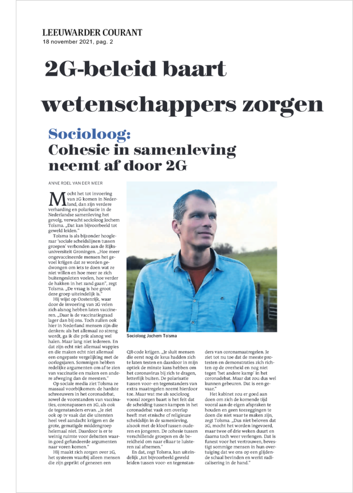

---
title: Meer polarisatie door nieuwe coronamaatregelen. 
author: Jochem Tolsma
date: '2021-11-18'
slug: LC
categories: [news]
tags: []
subtitle: ''
summary: 'Mocht het tot invoering van 2G komen in Nederland, dan zijn verdere verharding en polarisatie in de Nederlandse samenleving het gevolg, verwacht socioloog Jochem Tolsma. "Dat kan bijvoorbeeld tot geweld leiden.” […]'
lastmod: '2021-11-23'
featured: no
image: 
  caption: ''
  focal_point: ""
  placement: 1
  preview_only: true
projects: []
math: false
---  

**Nieuwe coronamaatregelen zullen spanningen tussen gevaccineerden en niet-gevaccineerden doen toenemen.** 

Voor originele publicaties zie [www.lc.nl](https://lc.nl/friesland/Socioloog-cohesie-in-samenleving-neemt-af-door-2G-27162895.html) / [lc.pdf](/files/lc.pdf) en [www.dvhn.nl](https://dvhn.nl/groningen/RUG-socioloog-Jochem-Tolsma-vreest-invoering-2G-in-strijd-tegen-corona-De-polarisatie-tussen-voor-en-tegenstanders-van-extra-maatregelen-neemt-toe-27163989.html) / [dvhn.pdf](/files/dvhn.pdf). <!---placed in static folder of homepage--->


```{r pressure, echo=FALSE, out.width = '100%'}

```
   

---  


